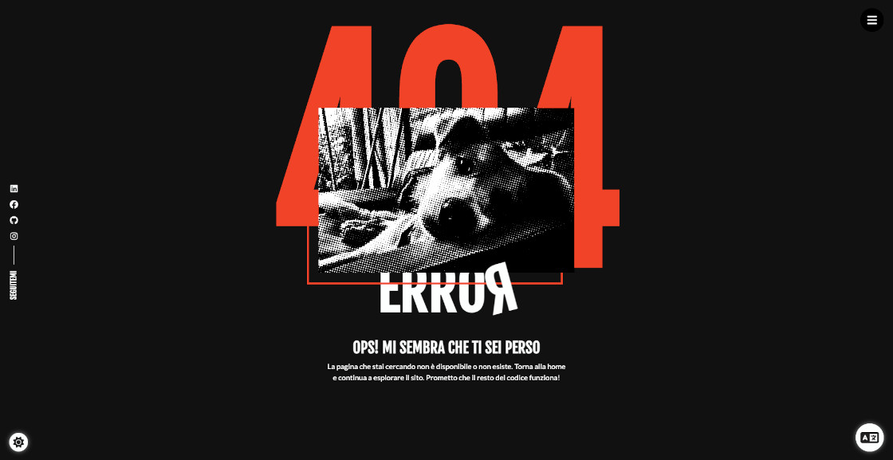

# Portfolio Website

A CV/portfolio template for developers built with React. Inspired in [react-portfolio](https://github.com/ubaimutl/react-portfolio).

To create the Typewriter effect I follow these two links

- [Typewritter Effect In React](https://medium.com/@hamzamakh/typewriter-effect-in-react-a103a4f385c9)
- [5 ways to implement typing animation in react](https://blog.logrocket.com/5-ways-implement-typing-animation-react/)

For the menu I used these codepens:

- [Split animation on hover with single element](https://codepen.io/ggsingla/pen/MWOzxbq)
- [Navi　Bar](https://codepen.io/yuhomyan/pen/WNwGywp)

To connect with emailjs on the contact form you can follow this guide:

- [Emailjs on react](https://medium.com/@alagappan.dev/using-emailjs-with-react-to-build-a-contact-form-for-your-website-5040966a814)

For the useApiHook I took the idea from here:

- [Creating a custom Hook to make requests using React + Axios + TypeScript](https://danilorivera95.medium.com/creating-a-custom-hook-to-make-requests-using-react-axios-typescript-ca591c6c25fc)

For the loading page I used:

- [Glowing Loader Ring Animation](https://codepen.io/Curlmuhi/pen/ExKWXKO)

To upload a JSON file directly to firebase you can use the function `initializeProfileData` that you can find on the file `src/services/fillFirebaseFromJSON.ts` that will take the info from `data_content.ts` under the same folder.

There is a button on the left bottom corner to change th theme

On the information section if the user clicks on the Download CV button the browser print screen will be prompt using custom print css properties.

The work experience menu has a dropdown that shows the technologic stack and the deve environment

There is a custom Error page

And finally the contact form

Details:

- rem units were used to make responsive design easier and all conected with the root font-size

### Features

- App created with Vite + React + React Router + Sass + Typescript + i18next + ESLint + Prettier + Husky + Jest + RTL

### Setup

Get the code

<pre>git clone https://github.com/gustavommarini/portfolio.git</pre>

Install required dependencies

<pre>yarn install</pre>

Start the server

<pre>yarn run dev</pre>
