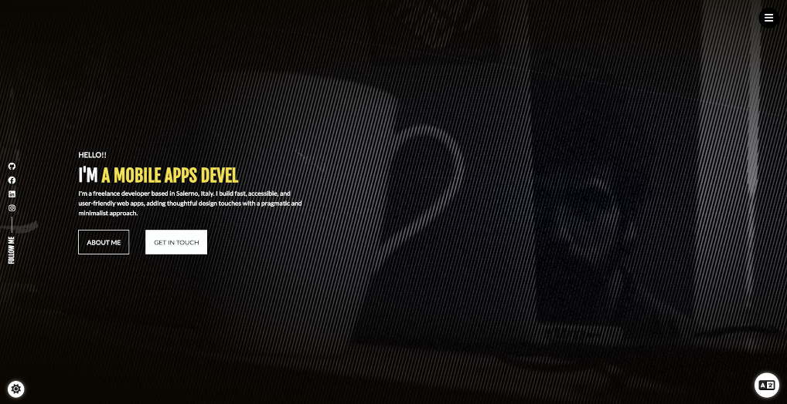

# Portfolio Website

A CV/portfolio template for developers built with React. Inspired in [react-portfolio](https://github.com/ubaimutl/react-portfolio).

To create the Typewriter effect I follow these two links

- [Typewritter Effect In React](https://medium.com/@hamzamakh/typewriter-effect-in-react-a103a4f385c9)
- [5 ways to implement typing animation in react](https://blog.logrocket.com/5-ways-implement-typing-animation-react/)

For the menu I used these codepens:

- [Split animation on hover with single element](https://codepen.io/ggsingla/pen/MWOzxbq)
- [Navi　Bar](https://codepen.io/yuhomyan/pen/WNwGywp)

### Features

- App created with Vite + React + React Router + Sass + i18next + ESLint + Prettier + Husky + Jest + RTL

### Setup

Get the code

<pre>git clone https://github.com/gustavommarini/portfolio.git</pre>

Install required dependencies

<pre>yarn install</pre>

Start the server

<pre>yarn run dev</pre>
